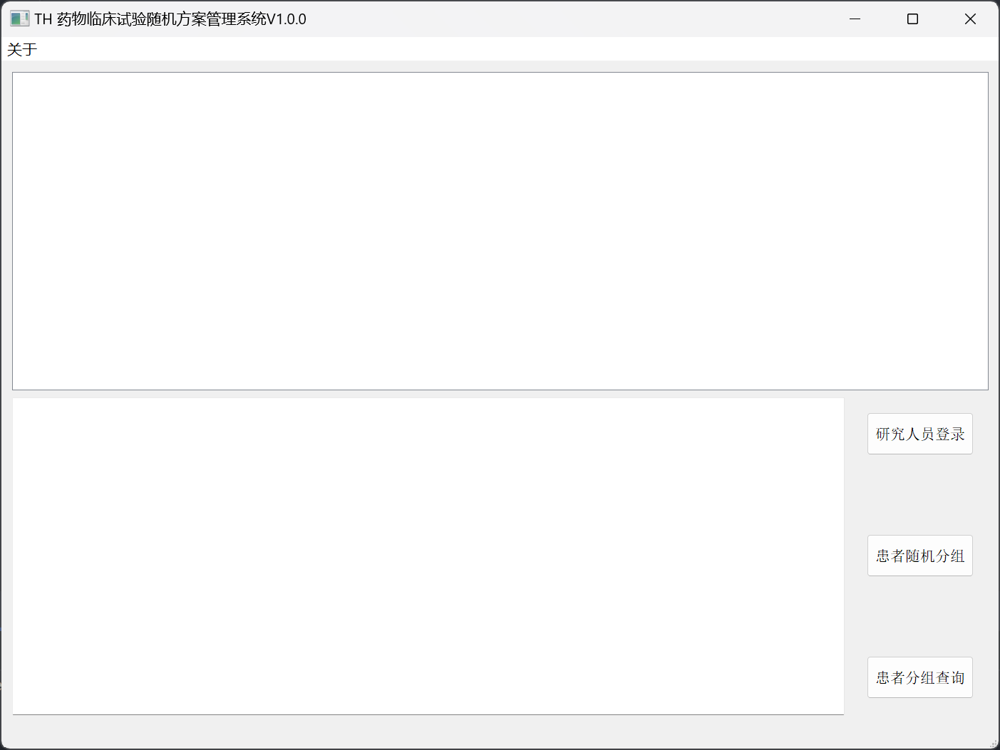

# THCode - 药物临床试验随机方案管理系统

> ### 简介
> &emsp;&emsp;药物临床试验随机方案管理系统是一个为临床试验设计的软件平台。系统能够根据预设的随机化方案，自动为参与者分配试验组别。
> ### 应用场景
> - 新药研发：用于新药的临床前和临床试验阶段，确保试验的科学性和合规性。
> - 药物效果评估：对现有药物进行效果评估和比较研究。

# 数据库表结构

## 1. 用户表(USERS)

| 账号 (Account) | 密码 (Password) | 所属试验表名 (TableName) | 所属中心 (CenterID) |
|:----------------:|:-----------------:|:----------------------:|:-------------------:|

> 数据类型 
> `账户`:  
> `密码`:  
> `TableName`:  

## 2. 数据分表

数据分表依据用户表(USERS)中分配信息分别命名为 `{USERS.TableName}_DATA`

| 患者编号 (ID) | 姓名 (Name) | 姓名拼音 (Pinyin) | 性别 (Gender) | 出生日期 (DateBirth) | 所属中心 (Center) | 药品编号 (DrugID) | 入组时间 (DataInput) | 破盲时间 (DateOutput) | 数据使用标签 (Flag) |
|:-------------:|:-------------:|:-----------------:|:---------------:|:--------------------:|:-----------------:|:-----------------:|:--------------------:|:---------------------:|:-----------------:|

> 数据类型 
> `ID`:  
> `名字`:  
> `Pinyin`:  
> `Gender`:  
> `DateBirth`:  
> `Center`:  
> `DrugID`:  
> `DataInput`:  
> `DateOutput`:  
> `Flag`:  

## 3. 药物对应分表

药物对应分表依据用户表(USERS)中分配信息分别命名为 `{USERS.TableName}_DRUG`

| 药物编号 (DrugID) | 药物名 (DrugName) |
|:-----------------:|:------------------:|

> 数据类型 
> `DrugID`:  
> `DrugName`:  

# 使用手册

> &emsp;&emsp;为了确保试验的双盲性, 同时也为了向研究者提供一个方便简洁的操作方法, 我们在上述代码的基础上设计了一款药物试验管理系统.  
> &emsp;&emsp;在该系统中, 研究者通过"录入"功能在录入受试者的基本信息后, 系统会根据预设的随机化分组方案为受试者分配对应的药物编号, 
> 同时在系统中记录受试者信息的录入时间. 在特殊情况下, 研究者能够通过"查询"功能对试验进行破盲, 并且在系统中记录破盲时间.

## 1. 用户窗体与主要功能

- **`研究人员登录`:** 研究者通过账户密码链接到数据库, 每个试验中心对应一个试验账号.
- **`患者随机分组`:** 在录入了受试者'姓名', '姓名拼音', '性别', '出生日期'信息后, 系统会根据预先设定的随机化分组方案在操作视图中输出受试者使用的药物编号. 
- **`患者分组查询`:** 在特殊情况下, 研究者需要提前获知受试者使用的药物, 可以通过受试者ID号在系统中进行破盲, 系统会在操作视图中输出ID号对应受试者所使用的药物.

